A sample illustation of integrating [OCI Devops](https://docs.oracle.com/en-us/iaas/Content/devops/using/home.htm) with [Sonarqube](https://www.sonarqube.org/) to assess the code quality and security.

-------

🪄 Objective .

-  Build a sample OCI build pipeline.
-  Integrate with Sonarqube.
-  Validate the integration.


🖨️ How to use it .

1. OCI Devops Setup

----

- Create an OCI Devops Project  - https://docs.oracle.com/en-us/iaas/Content/devops/using/devops_projects.htm 

* Create an OCI Build pipeline.

    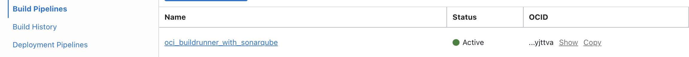

* Create an `OCI Vault`,the same will be used to store the credentials for external code repo connection if any and sonar sensitive attributes.

  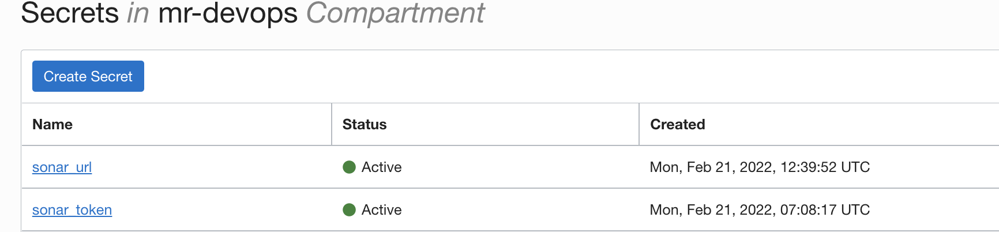

  * At this stage you wont be seeing any sonar related secrets in your Vault .Follow further steps.


* Clone this repo and push to one of the target code repo .You may use any of the OCI devops supported code repo for the usage (OCI Code repo ,Github,Gitlab etc)


* In this example we have used `GITHUB` with an `external connection` method with OCI devops.
  
  * Doc reference -  https://docs.oracle.com/en-us/iaas/Content/devops/using/create_connection.htm  

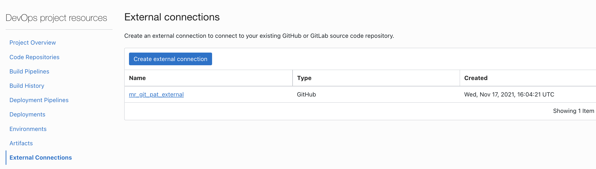

* Use the `OCI Build pipeline` and add a new stage. Use the `+` symbol and add `Managed Build` stage.

  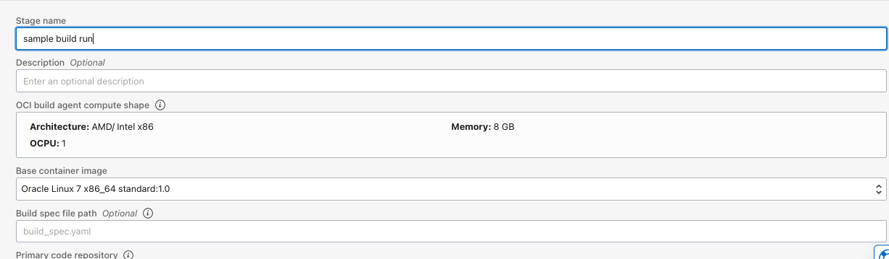

* Add the `primary source` respect to the code repo selected.

  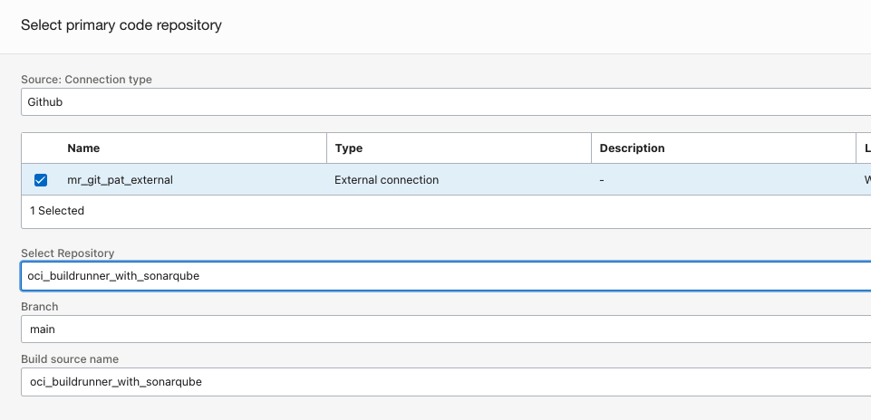

  * Documentation reference -  https://docs.oracle.com/en-us/iaas/Content/devops/using/add_buildstage.htm#add_buildstage


2. Setup the Sonarqube.

----

* You may use any of the official mode of Sonarqube installation method or use an existing one. We have used sonarqube deployment over kubernetes - [documentation](https://docs.sonarqube.org/latest/setup/sonarqube-on-kubernetes/).

* Create a new sonarqube project.

  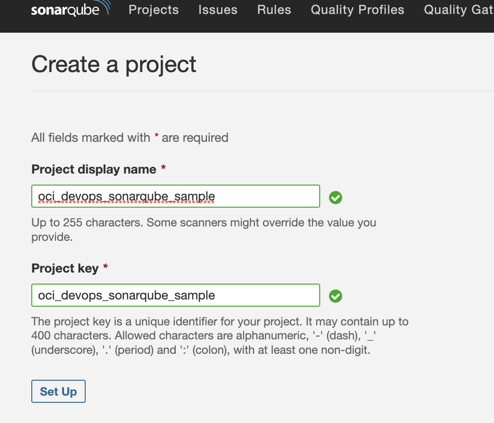

* Use `Other CI` option.

  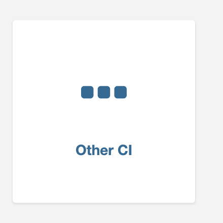


* Generate or reuse a sonar toekn.

  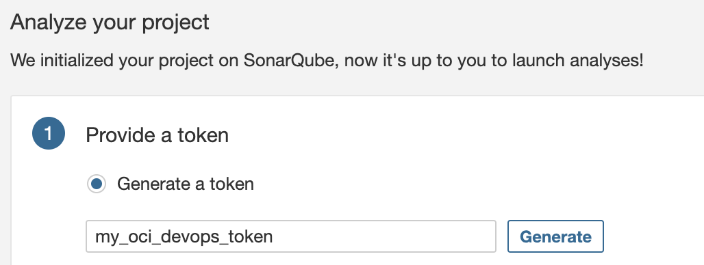

* Keep the `token` safely.


* Select `Others` as source code type and `OS` as `Linux`.


* Copy the `Execute` command lines.


  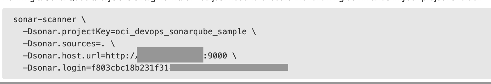


- Use `OCI Vault` and create new secrets as below 

  

  * Ensure to add the absolute URL for sonar_url. `eg:http://sonar.yourdmain.com:9000`.


- Update the file `build_spec.yaml` and push it back to the repo. We need to update the file with sonar properties.

  - variables 

  ```
  graal_vm_version : "21.3.0"
  sonar_cli_version : "Use the latest sonarqube-scanner cli"
  sonar_project: "Sonarqube project name"
  sonar_quality_wait: "true" |Marke as "false" if you wish to skip sonar checks
  ```

  - vaultVariables

  ```
  sonar_token: "OCI of Vault secret - sonar token "
  sonar_url: "OCI of Vault secret - sonar url"
  ```
- Sonarqube scanner CLI reference - https://docs.sonarqube.org/latest/analysis/scan/sonarscanner/ 
- A sample view 
  
  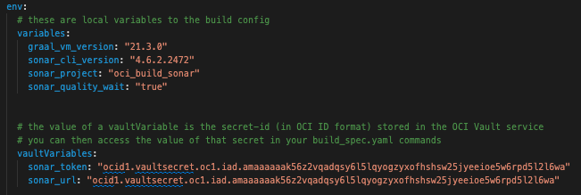


3. Validate the integration.

----

- Use `OCI Console` > `Developer services` >`Project` >`Project name` >`DevOps Resource`>`Build pipeline` >select the build pipeline .

  

- Click on `Start Manual run` and do an execution.

  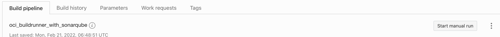

- 


References & Credits for base code

--- 
  - https://www.graalvm.org/docs/getting-started/container-images/

  - https://github.com/graalvm/graalvm-demos 


